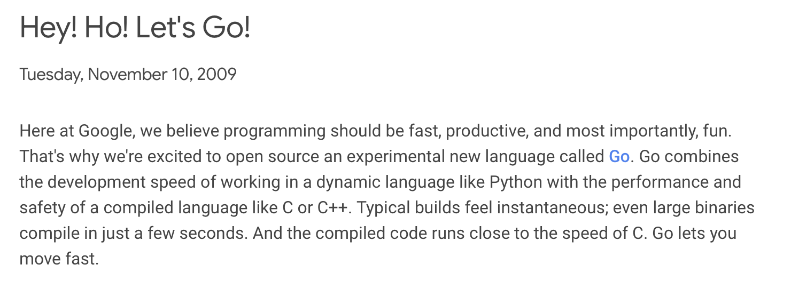
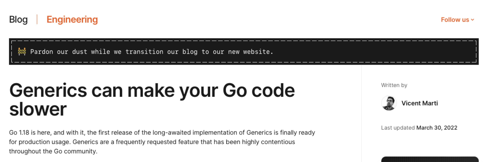

# The Inner Workings of Go Generics

<div class="absolute bottom-10">
  <span class="font-700">
    Anton Sankov
  </span>
</div>

<style>
h1 {
  font-weight: bold;
}
</style>

<!--
The last comment block of each slide will be treated as slide notes. It will be visible and editable in Presenter Mode along with the slide. [Read more in the docs](https://sli.dev/guide/syntax.html#notes)
-->

---
layout: full
---

<div class="grid grid-cols-[1fr_35%] gap-6" style="height: 100%">
<div>
  <div class="grid grid-rows justify-between" style="height: 100%">
  <div>
  
  # Anton Sankov
  ## Senior Software Engineer at Cast AI

  </div>

  - Programming in Go since 2019
  - Currently working on a Kubernetes Security Product

    <br>
    <div>
      <h2> <ri-linkedin-box-fill/><span style="font-weight: normal;"> Anton Sankov</span> </h2>
      <h2> <mdi-web/>/<ri-bluesky-fill/><span style="font-weight: normal;">asankov.dev</span> </h2>
    </div>
  </div>
</div>
  <div>
    
  </div>
</div>

<style>
  .mr-14{
    width: 200px;
  }

</style>

---
layout: statement
---

# What are Generics?

---
layout: statement
---

# A type of polymorphism that allows us to write code which work with different data-types while preserving type-safety

# Introduced in Go 1.18

<Links :hrefs="['https://en.wikipedia.org/wiki/Generic_programming']"/>

<style>
h1 {
  padding-bottom: 50px;
  font-size: 3rem !important;
}

</style>

---
layout: full
---

# Defining generic functions

<div class="full-center code-big">

```go {*}{lines: true}
func ToSlice[T any](a, b any) T[] {
  return []T{a, b}
}
```

</div>

<style>
.full-center {
  height: 100%;
  display: flex;
  flex-direction: row;
  align-items: center;
  justify-content: center;
  padding-bottom: 150px;
}

.code-big {
  --slidev-code-font-size: 1.5em !important;
  --slidev-code-line-height: 1.2em !important;
}
</style>


---
layout: full
---

# Calling generic functions

<div class="code-small pt-5px">

```go {*}{lines: true}
func ToSlice[T any](a, b any) T[] {
  return []T{a, b}
}
```

```go {4-5|7-8|10}{lines: true, startLine: 4}
intSlice := ToSlice[int](1, 2)           // intSlice if of type []int
floatSlice := ToSlice[float32](1.5, 2.5) // floatSlice if of type []float32

// type inference - we can be less verbose and omit the type
intSlice := ToSlice(1, 2) // intSlice if of type []int

anotherSlice := ToSlice(1, "string") // ❌ compile-time error: type mismatch
```

</div>

<style>
.code-small {
  --slidev-code-font-size: 0.9em !important;
  --slidev-code-line-height: 1em !important;
}
</style>

---
layout: statement
---

# A Little Bit of History

---
layout: default
---

# 2009

## Go is released to the world



<Links :hrefs="['https://opensource.googleblog.com/2009/11/hey-ho-lets-go.html']"/>

<style>
.center {
  display: block;
  margin-top: 50px;
  margin-left: auto;
  margin-right: auto;
  width: 75%;
}
</style>
---
layout: default
---

# Why create a new language?

<div style="margin-top: 100px; text-align: center;">

# Simplicity <span style="font-weight: normal;">(over C++)</span>
# Fast compilation time <span style="font-weight: normal;">(over C++)</span>
# Fast runtime <span style="font-weight: normal;">(same as C++)</span>

<div class="text-red-500 pt-30px" v-click>

  # Generics complicate all three
</div>

</div>

<Links :hrefs="['https://opensource.googleblog.com/2009/11/hey-ho-lets-go.html']"/>

<style>
h1 {
  margin-bottom: 20px;
}
</style>

---
layout: default
---

# 2009 (less than 24 hours later)

## Someone complains about the lack of generics


<Links :hrefs="['https://groups.google.com/g/golang-nuts/c/70-pdwUUrbI/m/onMsQspcljcJ']"/>

<style>
h1 {
  margin-bottom: 20px;
}

/* todo; duplicated */
.center {
  display: block;
  margin-top: 10px;
  margin-left: auto;
  margin-right: auto;
}
</style>

---

# 2009 <span class="font-normal"> - Language is publicly announced</span>

# 2010 <span class="font-normal">- First proposal for Generics -</span> Type Functions

# 2011 <span class="font-normal">- Second proposal for generics -</span> Generalized Types

# 2012 <span class="font-normal">- Go 1.0 is released</span>

# 2013 <span class="font-normal">- Third and fourth proposals -</span> Type Parameters and Generalized Types v2

# 2014

<style>
h1 {
  @apply pb-10px
}

h1::before {
   content: "";
    /* position: absolute; */
    /* left: -45px; Position the circle to align with the line */
    /* top: 0; */
    width: 25px;
    height: 25px;
    background: black;
    border-radius: 50%;
margin-top: 10px;
}
</style>

---

# 2015

# 2016

# 2017

# 2018 <span class="font-normal">- Fifth proposals -</span> Contracts

# 2019 <span class="font-normal">- Sixth proposals -</span> Contracts v2

# 2020

# 2021 <span class="font-normal">- Final and </span>ACCEPTED <span class="font-normal">proposal -</span> Type Parameters

<style>
h1 {
  @apply pb-10px
}

h1::before {
   content: "";
    /* position: absolute; */
    /* left: -45px; Position the circle to align with the line */
    /* top: 0; */
    width: 25px;
    height: 25px;
    background: black;
    border-radius: 50%;
margin-top: 10px;
}
</style>

---
layout: statement
---

# What took so long?

---
layout: default
---


<div v-click>

  # The generic dilemma is this:<br> do you want slow programmers, slow compilers and bloated binaries, or slow execution times?

</div>


<Links :hrefs="['https://research.swtch.com/generic']"/>

<style>
.default {
    padding-top: 10px
}
  /* todo; duplicated */
.center {
  display: block;
  margin-left: auto;
  margin-right: auto;
}

h1 {
  margin-top: 15px;
  text-align: center;
  font-size: 3rem;
  line-height: 1.2;
}
</style>
---
layout: default
---


<div class="fancy-table">

  | | Fast programmers | Fast compilers | Fast runtimes |
  | - | - | - | - |
  | <v-click at="1">C</v-click>    | <v-click at="+2">❌</v-click>  | <v-click at="+0">✅</v-click> | <v-click at="+0">✅</v-click> |
  | <v-click at="1">C++</v-click>  | <v-click at="+1">✅</v-click> | <v-click at="+0">❌</v-click> | <v-click at="+0">✅</v-click> |
  | <v-click at="1">Java</v-click> | <v-click at="+1">✅</v-click> | <v-click at="+0">✅</v-click> | <v-click at="+0">❌</v-click> |

</div>

<Links :hrefs="['https://research.swtch.com/generic']"/>

<style>
  /* todo; duplicated */
  .center {
    display: block;
    margin-left: auto;
    margin-right: auto;
  }
  .default {
    padding-top: 10px
}

</style>
---
layout: statement
---

# <span class="font-normal">Let's talk</span> implementation

---
layout: default
---

# None of the proposals provides implementation


<Links :hrefs="['https://go.googlesource.com/proposal/+/refs/heads/master/design/43651-type-parameters.md#implementation']"/>

---
layout: statement
---

# Let's write more proposals

---
layout: default
---

# Stenciling
## The C++ Way


<Links :hrefs="['https://github.com/golang/proposal/blob/master/design/generics-implementation-stenciling.md']"/>

---

<div class="flex">

<div class="codeblock code-medium">

# Before compilation
    
```go {*|5|6|*}{lines: true, at: '1'}
func Sum[T constraints.Ordered](a, b T) T {
    return a + b
}

i := Sum(1, 2)
f := Sum(1.5, 2.5)
```
</div>
<div class="codeblock code-medium flex flex-col">

# After compilation
    
```go {*|1-3,9|5-7,10|*}{lines: true, at: '1'}
func Sum_int(a, b int) int {
    return a + b
}

func Sum_float32(a, b float32) float32 {
    return a + b
}

i := Sum_int(1, 2)
f := Sum_float32(1.5, 2.5)
```
<span class="font-bold text-center pt-10px text-xl text-red-500">⚠️ Pseudo code ⚠️</span>
</div>
</div>

<Links :hrefs="['https://github.com/golang/proposal/blob/master/design/generics-implementation-stenciling.md']"/>

<style>
.codeblock {
  margin: 0 20px;
}

.code-medium {
  --slidev-code-font-size: 0.9em !important;
  --slidev-code-line-height: 1em !important;
}

h1 {
  text-align: center;
  padding-bottom: 20px;
}
</style>

---
layout: default
---

# Stenciling
## The C++ Way

<div class="list benefits text-2xl text-green-600 mt-50px font-bold">

  # Benefits
  
  - no performance penalty in runtime

</div>
<div class="drawbacks text-2xl text-red-600 font-bold">

  # Drawbacks
  
  - slower compilation time
  - bigger compiled binary size

</div>

<Links :hrefs="['https://github.com/golang/proposal/blob/master/design/generics-implementation-stenciling.md']"/>


---
layout: default
---

# Dictionaries
## The Java Way


<Links :hrefs="['https://github.com/golang/proposal/blob/master/design/generics-implementation-dictionaries.md', 'https://github.com/golang/proposal/blob/master/design/generics-implementation-dictionaries-go1.18.md']"/>

---

<div class="codeblock code-medium flex flex-col">

# Before compilation

```go {*}{lines: true}
func Sum[T constraints.Ordered](a, b T) T {
    return a + b
}

i := Sum(1, 2)
f := Sum(1.5, 2.5)
```

<Links :hrefs="['https://github.com/golang/proposal/blob/master/design/generics-implementation-dictionaries.md', 'https://github.com/golang/proposal/blob/master/design/generics-implementation-dictionaries-go1.18.md']"/>

</div>

<style>
  h1 {
  text-align: center;
  margin-bottom: 20px;
}
</style>
---

# After compilation

<div class="flex flex-row items-start">

  ```go
  type dictionary struct {
    T1 *runtime._type
    add func(a, b unsafe.Pointer) unsafe.Pointer
    // other fields and methods
  }
  
  func Sumg(
      dict dictionary, 
      a, b unsafe.Pointer
  ) unsafe.Pointer {
    return dict.add(a, b)
  }
  ```

  ```go
  intDictionary := dictionary{
    T1: reflect.TypeOf(a),
    add: func(a, b unsafe.Pointer) unsafe.Pointer {
        ai := *(*int)(a) // ai = 1
        bi := *(*int)(b) // bi = 2
        result := ai + bi // result = 3
        return unsafe.Pointer(&result)
    }
  }
  
  float32Dictionary := dictionary{ /* similar as intDictionary */ }
  
  a, b := 1, 2
  i := *(*int)Sumg(intDictionary, unsafe.Pointer(&a), unsafe.Pointer(&b))
  
  a, b := 1.5, 2.5
  f := *(*float32)Sumg(float32Dictionary, unsafe.Pointer(&a), unsafe.Pointer(&b))
  ```

</div>

<Links :hrefs="['https://github.com/golang/proposal/blob/master/design/generics-implementation-dictionaries.md', 'https://github.com/golang/proposal/blob/master/design/generics-implementation-dictionaries-go1.18.md']"/>

<style>
  pre.shiki {
    margin: 0 3px;
  }
</style>

---
layout: default
---

# Dictionaries
## The Java Way

<div class="list benefits text-2xl text-green-600 mt-50px font-bold">

  # Benefits
  
  - little to no performance penalty in compile-time

</div>
<div class="drawbacks text-2xl text-red-600 font-bold">

  # Drawbacks
  
  - slower runtime
  - more dereferences and method calls in runtime

</div>

<Links :hrefs="['https://github.com/golang/proposal/blob/master/design/generics-implementation-dictionaries.md', 'https://github.com/golang/proposal/blob/master/design/generics-implementation-dictionaries-go1.18.md']"/>


---
layout: default
---

# GC Shape Stenciling
## The Middle Ground


<Links :hrefs="['https://github.com/golang/proposal/blob/master/design/generics-implementation-gcshape.md', 'https://github.com/golang/proposal/blob/master/design/generics-implementation-dictionaries-go1.18.md']"/>
---

```go
func PrintAndReturn[T fmt.Stringer](t T) T {
  fmt.Println(t.String())
  return t
}

type printableInt int 
type printableString string

func (i printableInt) String() string { return fmt.Sprintf("%d", i) }
func (i printableString) String() string { return string(s) }

type A struct{}
type B struct{}

func (a *A) String() string { return "A" }
func (a *B) String() string { return "B" }

func main() {
  _ = PrintAndReturn(printableInt(1))
  _ = PrintAndReturn(printableString("string"))

  _ = PrintAndReturn(&A{})
  _ = PrintAndReturn(&B{})
}
```
---

```shell {lines: false}
# build the program
go build -gcflags="-N -l" -o generics main.go

# dissasemble the executable
go tool objdump generics > objdump.txt
```

---

<div class="flex flex-row">

```go {*|24|25|27-28}{lines: false, at: '1'}
func PrintAndReturn[T fmt.Stringer](t T) T {
  fmt.Println(t.String())
  return t
}

type printableInt int 
type printableString string

func (i printableInt) String() string {
  return fmt.Sprintf("%d", i) 
}

func (i printableString) String() string { 
  return string(s) 
}

type A struct{}
type B struct{}

func (a *A) String() string { return "A" }
func (a *B) String() string { return "B" }

func main() {
  _ = PrintAndReturn(printableInt(1))
  _ = PrintAndReturn(printableString("string"))

  _ = PrintAndReturn(&A{})
  _ = PrintAndReturn(&B{})
}
```

```asm {*|1-6|8-13|15-19}{lines: false, at: '1'}
TEXT main.PrintAndReturn[go.shape.int](SB)
   main.go:5 0x10008c80 f9400b90 MOVD 16(R28), R16
   main.go:5 0x10008c84 eb3063ff CMP R16, RSP
   main.go:5 0x10008c88 54000269 BLS 19(PC)
   main.go:5 0x10008c8c f81c0ffe MOVD.W R30, -64(RSP)
   // more instructions

TEXT main.PrintAndReturn[go.shape.string](SB)
   main.go:5 0x10008c00 f9400b90 MOVD 16(R28), R16
   main.go:5 0x10008c04 eb3063ff CMP R16, RSP
   main.go:5 0x10008c08 540002a9 BLS 21(PC)
   main.go:5 0x10008c0c f81c0ffe MOVD.W R30, -64(RSP)
   // more instructions

TEXT main.PrintAndReturn[go.shape.*uint8](SB)
   main.go:5 0x10008c90 f9400b90 MOVD 16(R28), R16
   main.go:5 0x10008c94 eb3063ff CMP R16, RSP
   main.go:5 0x10008c98 54000269 BLS 19(PC)
   // more instructions
```

</div>

<style>
  pre.shiki {
    margin: 0 3px;
  }
</style>

---

<div class="flex flex-row">

```go {*|1-4}{lines: false, at: '1'}
func PrintAndReturn[T fmt.Stringer](t T) T {
  fmt.Println(t.String())
  return t
}

type printableInt int 
type printableString string

func (i printableInt) String() string { 
  return fmt.Sprintf("%d", i)
}

func (i printableString) String() string { 
  return string(s)
}

type A struct{}
type B struct{}

func (a *A) String() string { return "A" }
func (a *B) String() string { return "B" }

func main() {
  _ = PrintAndReturn(printableInt(1))
  _ = PrintAndReturn(printableString("string"))

  _ = PrintAndReturn(&A{})
  _ = PrintAndReturn(&B{})
}
```

<span style="margin: 0 6px;">

```asm {*|1-3|1,4-7|8|9-18}{lines: false, at: '1'}
TEXT main.PrintAndReturn[go.shape.*uint8](SB)
   main.go:6 0x10008e638 f90047e0 MOVD R0, 136(RSP)
   main.go:6 0x10008e63c f9004be1 MOVD R1, 144(RSP)
   main.go:6 0x10008e644 f94047fa MOVD 136(RSP), R26
   main.go:6 0x10008e648 3980035b MOVB (R26), R27
   main.go:6 0x10008e64c f9400341 MOVD (R26), R1
   main.go:6 0x10008e650 f9404be0 MOVD 144(RSP), R0
   main.go:6 0x10008e654 d63f0020 CALL (R1)
   main.go:6 0x10008e658 f90037e0 MOVD R0, 104(RSP)
   main.go:6 0x10008e65c f9003be1 MOVD R1, 112(RSP)
   main.go:6 0x10008e660 a905ffff STP (ZR, ZR), 88(RSP)
   main.go:6 0x10008e664 910163e1 ADD $88, RSP, R1
   main.go:6 0x10008e66c f9001fe1 MOVD R1, 56(RSP)
   main.go:6 0x10008e666 f94037e0 MOVD 104(RSP), R0
   main.go:6 0x10008e670 f9403be1 MOVD 112(RSP), R1
   main.go:6 0x10008e674 97fdec5f CALL runtime.convTstring(SB)
   // some instructions removed for brevity
   main.go:6    0x10008e6dc   97ffe621    CALL fmt.Println(SB)
```

<div>
<v-switch>
  <template #1>
    <div>
          <div>R0 - Type Dictionary</div>
          <div>R1 - Value t</div>
          <br>
          <div>Type Dictionary - 136(SRP)</div>
          <div>Value t - 144(RSP)</div>
          <br>
          <div>RSP - Current Stack Pointer</div> 
    </div>
  </template>
  <template #2>
    <div>
      <div>R0 - Value t</div>
      <div>R1 - (*A/*B).String()</div>
      <br>
      <div>Type Dictionary - 136(SRP)</div>
      <div>Value t - 144(RSP)</div>
      <br>
      <div>RSP - Current Stack Pointer</div>
    </div>
  </template>
  <template #4>
    <div class="text-center">
      Full example and instructions at <br> <a href="github.com/asankov/go-generics">github.com/asankov/go-generics</a>
      
    </div>
  </template>
</v-switch>
</div>
</span>
</div>

---
layout: default
---

# GC Shape Stenciling
## The Middle Ground

<div class="list benefits text-2xl text-green-600 mt-50px font-bold">

  # Benefits
  
  - little performance penalty in compile-time
  - little (to high*) performance penalty in runtime

</div>
<div class="drawbacks text-2xl text-red-600 font-bold">

  # Drawbacks
  
  - little performance penalty in compile-time
  - little (to high*) performance penalty in runtime

</div>

<Links :hrefs="['https://github.com/golang/proposal/blob/master/design/generics-implementation-gcshape.md', 'https://github.com/golang/proposal/blob/master/design/generics-implementation-dictionaries-go1.18.md']"/>

---
layout: default
---

# How big can the runtime performance hit be?



<Links :hrefs="['https://planetscale.com/blog/generics-can-make-your-go-code-slower']"/>
---
layout: default
---

# How big can the runtime performance hit be?
## TLDR

<div class="flex flex-col">

  - Using generics in low-level mission critical code can have <span class="font-bold">big*</span> performance hit <br>
  (Using interface can cause similar, but <span class="font-bold">smaller*</span> performance hit)
  - <span class="font-bold">Worst case scenario*</span> is passing interfaces to generic methods <br>
  (double dictionary lookup and double dereferencing)
  
  - If this matters to you just don't use generics; non-generic code has not gotten slower 
  
  <span class="font-bold text-right">
    <div class="mb-10px" > baseline = 5 µs </div>
    <div> *big == 2-3 µs </div>
    <div> *smaller == 1-2 µs </div>
    <div> *worst case == 3-5 µs </div>
  </span>
</div>


<Links :hrefs="['https://planetscale.com/blog/generics-can-make-your-go-code-slower']"/>
---
layout: default
---

# Summary

<div class="mt-50px">
  
  - Generics have been a long-waited feature for some part of the community
  - The Go team finally shipped it after 13 years, because they wanted to make it right
  - There are some performance implications to using generics, but they will probably not impact a big percent of the language users
  - The performance can be improved in future releases, as the specs don't prevent further optimisations

</div>
---

<div class="fancy-table">

| | Fast programmers | Fast compilers | Fast runtimes |
| - | - | - | - |
| C    | ❌  |✅ | ✅ |
| C++  | ✅ | ❌ | ✅ |
| Java | ✅ | ✅ | ❌ |
| Go |  <v-click at="+1">✅</v-click> | <v-click at="+1"><span class="text-green-600 font-bold">Yes, mostly</span></v-click> | <v-click at="+1"><span class="text-orange-500 font-bold">Yes, with some caveats</span></v-click> |

</div>

---
layout: section
---

<div class="flex flex-col">

  # Thank you!
  
  # Questions?
  
  <div class="flex flex-rows justify-between mt-30px">
    <div style="text-align: right;">
      <h2> <ri-linkedin-box-fill/><span style="font-weight: normal;"> Anton Sankov</span> </h2>
      <h2> <mdi-web/>/<ri-bluesky-fill/><span style="font-weight: normal;">asankov.dev</span> </h2>
    </div>
    <div>
      <div class="font-bold text-xl">Download the slides</div>
      
    </div>
  </div>

</div>

<style>
h1 {
  margin: auto;
  padding: 15px 0;
}
h2 {
  padding: 5px 0;
}
</style>